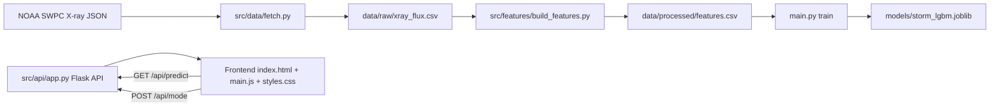

# Perihelion.ai

Perihelion.ai, uzay hava verisiyle (NOAA SWPC GOES X-ray) kısa ufuklu risk tahmini denemesi yapan bir makine ogrenmesi hattini ve canli demo panelini birlestiren bir projedir.

Bu repoda iki paralel akıs vardir:

1. Veri ve model hattı (fetch -> feature engineering -> train -> model bundle)
2. Flask tabanli demo API + frontend paneli (sakin/firtina modu, canli gorsellestirme)

Amac, hem teknik bir ML prototipi hem de sunumda anlatilabilir bir sistem mimarisi ortaya koymaktir.

## Icerik

1. Proje Ozeti
2. Sistem Mimarisi
3. Klasor Yapisi
4. Veri Hatti ve Modelleme
5. API Sozlesmesi
6. Frontend Calisma Mantigi
7. Kurulum ve Calistirma
8. Uretim ve Gelistirme Notlari
9. Sorun Giderme

## Proje Ozeti

- Veri kaynagi: NOAA SWPC GOES X-ray JSON servisi
- Hedef: Gelecekteki flux rejimine gore ikili risk etiketi uretmek
- Model: LightGBM classifier
- Backend: Flask + CORS
- Frontend: Vanilla JS + Chart.js + Three.js

Not: Bu repo, operasyonel bir resmi erken uyari sistemi iddiasi tasimaz. Egitim, prototipleme ve demo odaklidir.

## Sistem Mimarisi

Asagidaki mimari, veri/ML hattini ve canli dashboard akislarini birlikte gosterir.



### Bilesenler

- Veri cekme: `src/data/fetch.py`
- Ozellik uretimi: `src/features/build_features.py`
- Model egitimi ve kaydetme: `main.py`, `src/api/predict.py`
- Demo API: `src/api/app.py`
- Dashboard UI: `frontend/index.html`, `frontend/main.js`, `frontend/styles.css`

## Klasor Yapisi

```text
perihelion.ai-main/
|-- main.py
|-- Makefile
|-- requirements.txt
|-- README.md
|-- docs/
|   `-- RAPOR.md
|-- frontend/
|   |-- index.html
|   |-- main.js
|   |-- styles.css
|   |-- logo/
|   `-- assets/
`-- src/
		|-- api/
		|   |-- app.py
		|   `-- predict.py
		|-- data/
		|   |-- fetch.py
		|   `-- preprocess.py
		`-- features/
				`-- build_features.py
```

Calisma sirasinda olusan ciktilar:

- `data/raw/xray_flux.csv` (fetch sonrasi)
- `data/processed/features.csv` (feature engineering sonrasi)
- `models/storm_lgbm.joblib` (training sonrasi)

## Veri Hatti ve Modelleme

### 1. Veri cekme

`src/data/fetch.py`, SWPC JSON endpointinden veriyi alir ve tabloya cevirir.

- Endpoint: `https://services.swpc.noaa.gov/json/goes/primary/xrays-6-hour.json`
- Zaman alani: `time_tag` UTC datetime'a cevrilir
- Cikti: `data/raw/xray_flux.csv`

Calistirma:

```bash
python -m src.data.fetch
```

### 2. Ozellik uretimi

`src/features/build_features.py` icinde asagidaki turev ozellikler uretilir:

- `flux_lag1`, `flux_lag3`, `flux_lag6`
- `flux_ratio`
- `rolling_mean_3`, `rolling_mean_6`
- `flux_diff`

Etiket mantigi:

- Gelecek adim: `FUTURE_STEPS = 3`
- Label: gelecekteki flux degeri secilen esigin uzerindeyse `1`, degilse `0`
- Esik secimi: quantile adaylari -> std tabanli adaylar -> yedek median/ara deger

Calistirma:

```bash
python src/features/build_features.py
```

### 3. Model egitimi

`main.py` su adimlari yapar:

1. `data/processed/features.csv` okur
2. Sayisal/bool feature setini cikarir
3. Stratified train/test bolmesi yapar
4. LightGBM modeli egitir
5. Model + feature listesi bundle olarak kaydeder
6. Test raporu (classification_report) basar

Model cikti dosyasi:

- `models/storm_lgbm.joblib`

Calistirma:

```bash
python main.py
```

## API Sozlesmesi

Backend dosyasi: `src/api/app.py`

Varsayilan port: `5050`

### `GET /health`

Servis saglik bilgisi dondurur.

Ornek cevap:

```json
{
	"status": "ok",
	"mode": "calm",
	"intensity": 0.0
}
```

### `GET /api/predict`

Demo telemetri payload'i dondurur.

Ornek cevap:

```json
{
	"time": "2026-03-29T12:00:00Z",
	"windSpeed": 323.5,
	"protonDensity": 3.2,
	"kpIndex": 1.7,
	"aiPredictionKp": 1.8,
	"bz": 4.3,
	"electronFlux": 1780
}
```

### `POST /api/mode`

Demo senaryo modunu degistirir.

Istek:

```json
{ "mode": "storm" }
```

Gecerli degerler:

- `calm`
- `storm`

Gecersiz body durumunda `400` dondurur.

### `GET /` ve static servis

Frontend varsa `index.html` sunulur, yoksa `503` ve API referansi dondurulur.

Servis edilen dosyalar:

- `/main.js`
- `/styles.css`
- `/logo/<name>`
- `/assets/<name>`

## Frontend Calisma Mantigi

Frontend dosyalari `frontend/` altindadir.

Temel davranis:

1. `main.js`, ortamdan backend URL'i cikarir
2. Periyodik olarak `/api/predict` cagirir
3. Gelen metrikleri gauge, kartlar ve timeline'a yansitir
4. Chart.js ile canli telemetri cizgilerini gunceller
5. Three.js ile gorsel sahneyi render eder

Not: Frontend'deki panel dili Turkce, telemetri etiketleri operasyonel dashboard formatinda kurgulanmistir.

## Kurulum ve Calistirma

### Gereksinimler

- Python 3.10+
- `pip`

Bagimliliklar `requirements.txt` dosyasindadir.

### Yontem A: Dogrudan pip ile

```bash
pip install -r requirements.txt
```

Pipeline:

```bash
python -m src.data.fetch
python src/features/build_features.py
python main.py
python src/api/app.py
```

### Yontem B: Makefile ile (Linux/macOS)

```bash
make install
make pipeline
make api
```

Not: Mevcut `Makefile`, Unix tarzi venv yolu (`.venv/bin/python`) kullaniyor. Windows'ta ya komutlari dogrudan `python` ile calistirin ya da Makefile'i platforma gore uyarlayin.

## Uretim ve Gelistirme Notlari

- `src/api/app.py` icindeki `/api/predict` su an sunum/simulasyon odakli bir payload dondurur.
- Gercek model risk skorunu API'ye eklemek icin `src/api/predict.py` fonksiyonlari (`predict_storm`, `predict_latest_from_csv`) endpoint'e baglanabilir.
- `RAMP_SECONDS` (varsayilan 90 sn), `calm/storm` gecisindeki yumusak gecis suresini belirler.

Onerilen sonraki adimlar:

1. `/api/predict` cevabina `storm_risk` alanini modelden eklemek
2. Zaman bazli train/test ayrimi ile gecmis-gelecek sizintisini azaltmak
3. Metrik loglamayi dosyaya veya bir izleme sistemine acmak

## Sorun Giderme

### `Model not found at models/storm_lgbm.joblib`

Model henuz egitilmemistir. Once:

```bash
python main.py
```

### `Features CSV not found at data/processed/features.csv`

Ozellik dosyasi uretilmemistir. Once:

```bash
python src/features/build_features.py
```

### Frontend aciliyor ama veri gelmiyor

Kontrol listesi:

1. API calisiyor mu (`python src/api/app.py`)?
2. `http://127.0.0.1:5050/health` `status=ok` donuyor mu?
3. Frontend'in baglandigi URL ile API portu ayni mi?

## Lisans ve Kullanim

Bu repo egitim ve prototipleme amaclidir. Operasyonel karar destek sistemi olarak tek basina kullanilmamasi onerilir.

---

Detayli teknik rapor icin: `docs/RAPOR.md`
