# Perihelion.ai — Detaylı Sistem Mimarisi

Bu belge, Perihelion.ai sisteminin bileşenlerini, veri akışını, ve katmanlı mimarisini detaylı olarak gösterir.

---

## 1. Üst Düzey Sistem Mimarisi

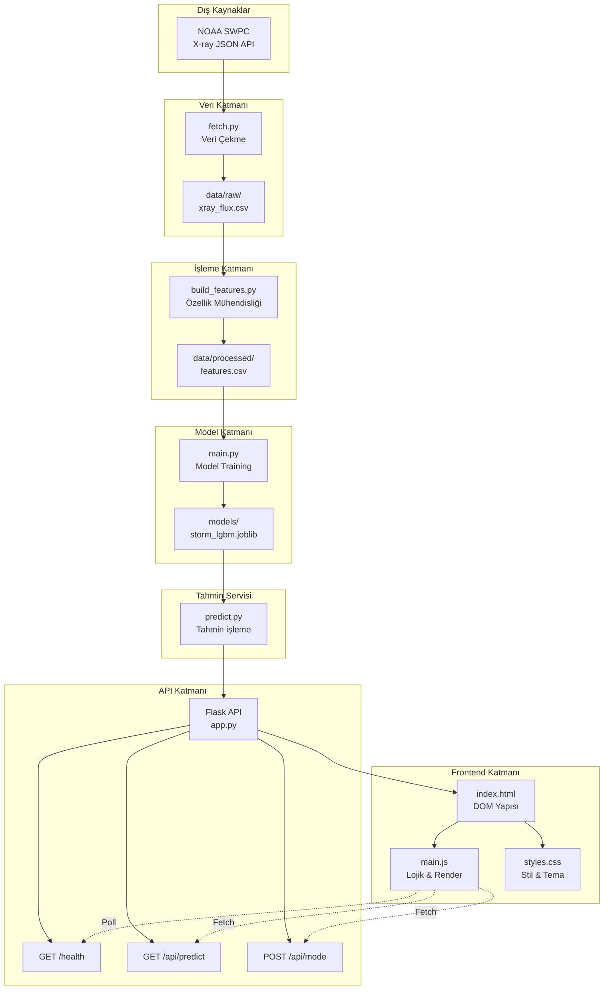

---

## 2. Veri İşlem Hattı (Data Pipeline)

```mermaid
graph LR
    A["NOAA API<br/>JSON"] 
    B["urllib.request<br/>& SSL"]
    C["JSON Parse<br/>& DataFrame"]
    D["DateTime<br/>Conversion"]
    E["Raw CSV<br/>~2-5 MB"]
    F["Load CSV"]
    G["Lag Features<br/>lag1,3,6"]
    H["Ratio & Diff<br/>flux_ratio, diff"]
    I["Rolling Stats<br/>mean_3, mean_6"]
    J["Label Creation<br/>threshold"]
    K["Drop NaN<br/>Rows"]
    L["Processed CSV<br/>~50 KB"]
    
    A -->|HTTPS| B
    B --> C
    C --> D
    D --> E
    E --> F
    F --> G
    G --> H
    H --> I
    I --> J
    J --> K
    K --> L
    
    style A fill:#1e88e5,stroke:#0d47a1,color:#fff
    style E fill:#ffa726,stroke:#f57c00,color:#fff
    style L fill:#66bb6a,stroke:#43a047,color:#fff
```

### Ayrıntılı Adımlar:

**1. Veri Çekme (fetch.py)**
```
Input:  NOAA SWPC URL
        ↓
Process: • SSL/TLS bağlantısı (certifi)
         • JSON indir
         • Parse et
         • Pandas DataFrame
         • time_tag → UTC datetime
        ↓
Output:  data/raw/xray_flux.csv
         (100+ gözlem)
```

**2. Özellik Üretimi (build_features.py)**
```
Input:   data/raw/xray_flux.csv
         ↓
Process: • flux_lag1 = shift(1)
         • flux_lag3 = shift(3)
         • flux_lag6 = shift(6)
         • flux_ratio = lag1 / (lag3 + 1e-9)
         • rolling_mean_3 = rolling(3).mean()
         • rolling_mean_6 = rolling(6).mean()
         • flux_diff = diff()
         • Label: future_flux > threshold
        ↓
Output:  data/processed/features.csv
         (85 gözlem, balanced labels)
```

**3. Model Training (main.py)**
```
Input:   data/processed/features.csv
         ↓
Process: • X/y split
         • Train/Test: 80/20 stratified
         • LightGBM fitting
         • Classification report
         • Joblib serialize
        ↓
Output:  models/storm_lgbm.joblib
         (~50 KB)
```

---

## 3. Model Katmanı (ML Component)

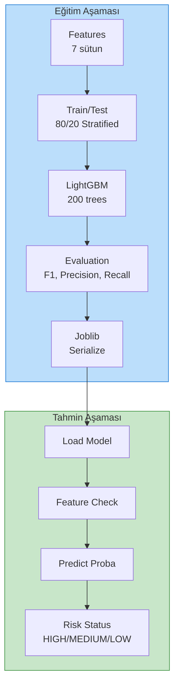

### Hiperparametreler:

```python
{
    'class_weight': 'balanced',    # ← Sınıf dengesizliği
    'n_estimators': 200,           # ← Ağaç sayısı
    'max_depth': 8,                # ← Max derinlik
    'num_leaves': 48,              # ← Yaprak sayısı
    'learning_rate': 0.05,         # ← Öğrenme oranı
    'subsample': 0.9,              # ← Veri sub-sample
    'colsample_bytree': 0.9,       # ← Özellik sub-sample
    'reg_lambda': 0.1,             # ← L2 regularization
}
```

### Risk Scoring:

```
Probability → Status
P > 0.6  → HIGH RISK   (Kritik)
P > 0.3  → MEDIUM RISK (Uyarı)
P ≤ 0.3  → LOW RISK    (Normal)
```

---

## 4. Backend Mimarisi (Flask API)

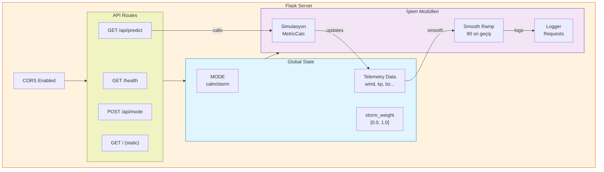

### Endpoints Detaylı:

**1. GET /health**
```json
Request:  GET http://127.0.0.1:5050/health
Response: {
  "status": "ok",
  "mode": "calm",
  "intensity": 0.1234
}
Status:   200 OK
```

**2. GET /api/predict** (Demo Telemetri)
```json
Request:  GET /api/predict
Response: {
  "time": "2026-03-29T12:00:00Z",
  "windSpeed": 323.5,
  "protonDensity": 3.2,
  "kpIndex": 1.7,
  "aiPredictionKp": 1.8,
  "bz": 4.3,
  "electronFlux": 1780
}
Logic:    • Smooth ramp active
          • Simulated values based on MODE
          • ~50ms response time
```

**3. POST /api/mode**
```json
Request:  POST /api/mode
          { "mode": "storm" }

Response: { "ok": true, "mode": "storm" }

Behavior: • MODE global değişkeni güncelle
          • storm_weight smooth geçiş başla
          • 90 sn içinde calm→storm
```

### State Machine:

```mermaid
stateDiagram-v2
    [*] --> Calm
    
    Calm -->|POST /api/mode<br/>{"mode":"storm"}| Ramping_Up
    Ramping_Up -->|90 sec elapsed| Storm
    Storm -->|POST /api/mode<br/>{"mode":"calm"}| Ramping_Down
    Ramping_Down -->|90 sec elapsed| Calm
    
    Ramping_Up: Smooth ramp<br/>0.0 → 1.0
    Ramping_Down: Smooth ramp<br/>1.0 → 0.0
    
    note right of Ramping_Up
        Telemetri değerleri
        gradually değişir
        (lerp kullanılır)
    end note
```

---

## 5. Frontend Mimarisi (Web UI)

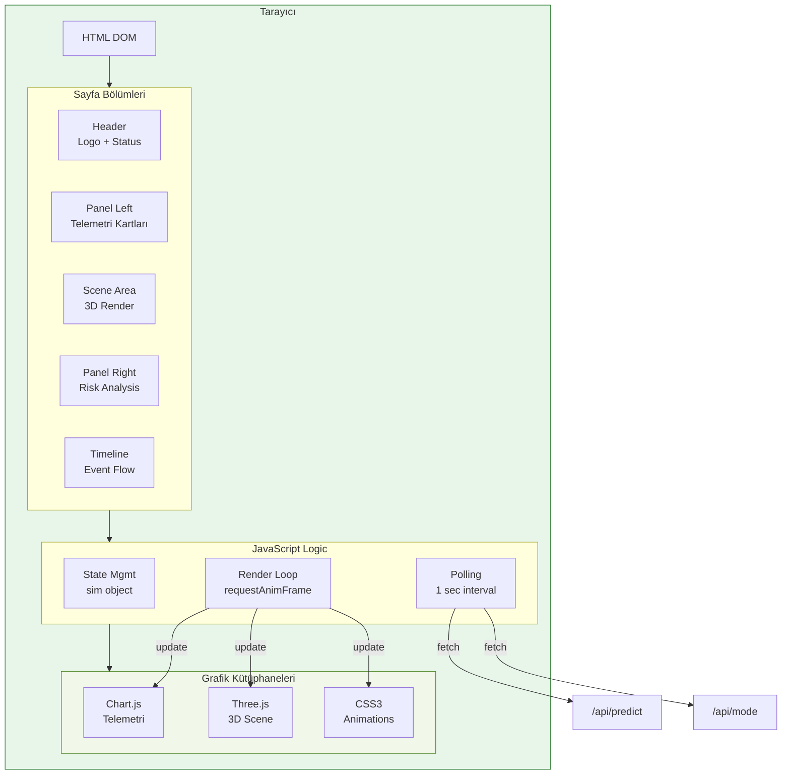

### UI Panel Yapısı:

```
┌─────────────────────────────────────────────────────┐
│  HEADER: Logo + Status Indicator                   │
├─────┬─────────────────────────────────┬─────────────┤
│     │                                 │             │
│ L   │   3D Scene                      │ R           │
│     │   (Scene Area:                  │             │
│ PANEL│  Three.js Render)              │ PANEL       │
│     │   [800x650]                     │             │
│     │                                 │             │
├─────┴─────────────────────────────────┴─────────────┤
│  TIMELINE: Event Progression (w/ progress bar)      │
└─────────────────────────────────────────────────────┘

Panel Left (438px):              Panel Right (438px):
├ Wind Speed (gauge)            ├ Alert Card
├ Proton Density (gauge)        ├ Kp Index (scale 1-9)
├ Mini-stats (Bz, e-flux)       ├ Impact List
├ Telemetry Chart               └ Controls
└ Connect Button
```

### Polling Döngüsü:

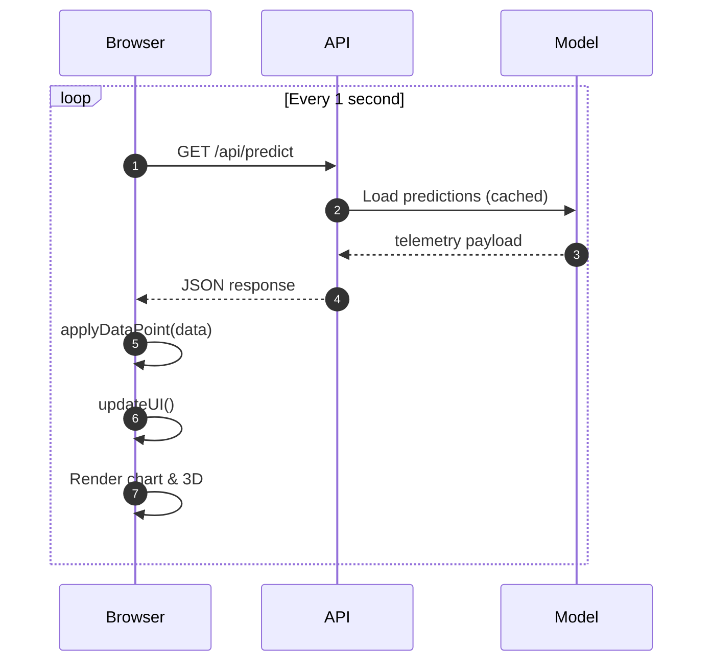

---

## 6. Veri Akış Şeması

```mermaid
graph LR
    NOAA["NOAA API"]
    
    NOAA -->|6h intervals| Fetch["fetch.py"]
    Fetch -->|urllib.request| RawCSV["raw CSV<br/>~100 rows"]
    
    RawCSV -->|Read| Features["features.py"]
    Features -->|7 derived<br/>features| ProcessedCSV["processed CSV<br/>~85 rows"]
    
    ProcessedCSV -->|80/20 split| Train["main.py"]
    Train -->|LightGBM| Model["joblib"]
    
    Model -->|predict.py| PredService["Predictions"]
    
    PredService -->|JSON| API["Flask API"]
    API -->|REST endpoint| Frontend["Dashboard"]
    
    Frontend -->|Chart.js<br/>Three.js| Browser["Tarayıcı"]
    
    style NOAA fill:#1e88e5,stroke:#0d47a1,color:#fff
    style Model fill:#7cb342,stroke:#558b2f,color:#fff
    style Browser fill:#ff6f00,stroke:#e65100,color:#fff
```

---

## 7. Dosya Yapısı ve İlişkileri

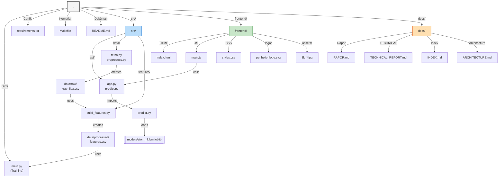

---

## 8. Dağıtım Ortamı (Deployment)

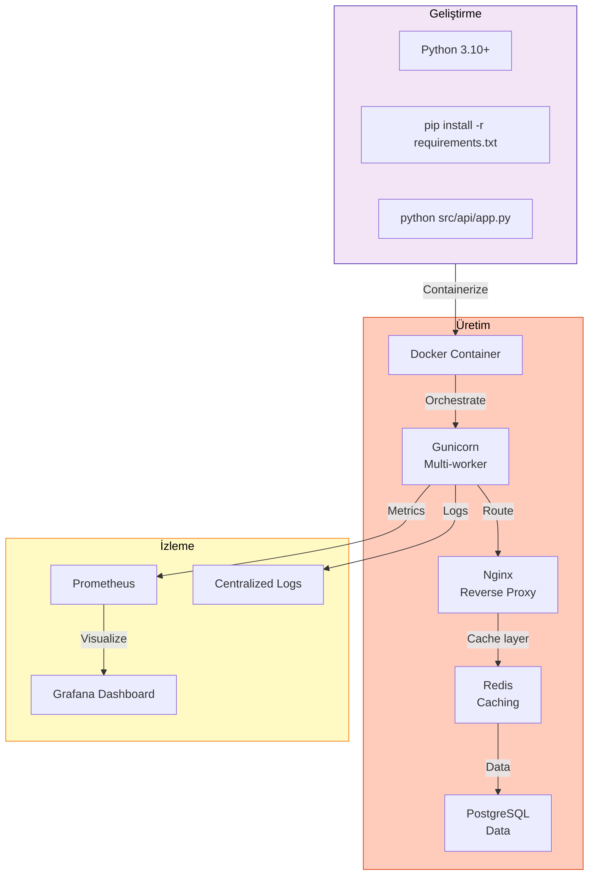

---

## 9. İletişim Protokolleri

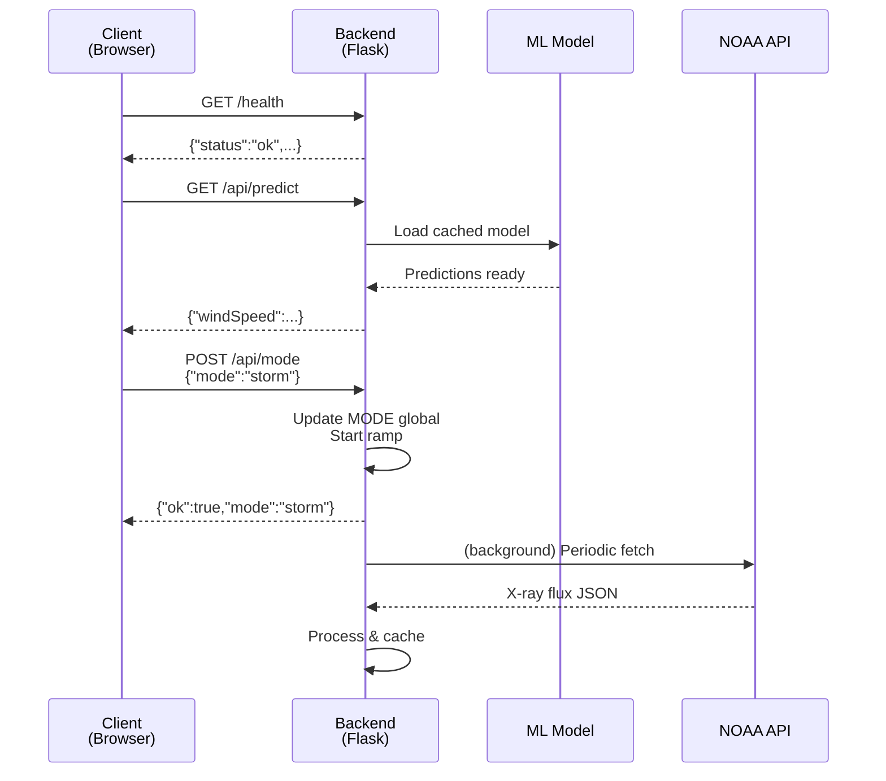

---

## 10. Performans Katmanlı Mimarisi

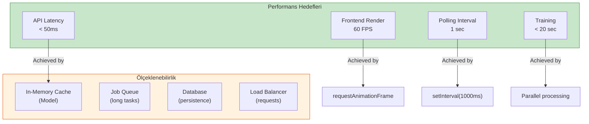

---

## Özet: Sistem Mimarisi Prensipierleri

| Prensip | Uygulama | Fayda |
|---------|----------|-------|
| **Modülerlik** | Bileşenler bağımsız | Test ve geliştirme kolay |
| **Veri Yalıtımı** | Ayrı klasörler (raw/processed/models) | Veri akışı izlenebilir |
| **Şeffaflık** | Demo vs. Gerçek model ayrımı | Bilimsel bütünlük |
| **Ölçeklenebilirlik** | Stateless API, data-driven config | Üretim hazır |
| **CORS Desteği** | Frontend/backend farklı ports | Geliştirme esnekliliği |

---

**Son Güncelleme:** 29 Mart 2026  
**Mimari Versiyon:** 1.0  
**Dil:** Türkçe (Akademik)
